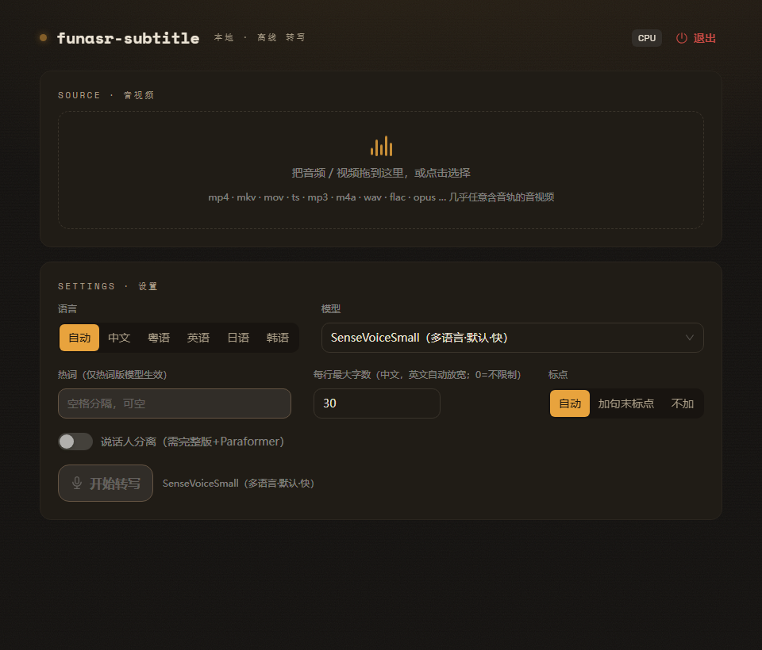

<div align="center">

# funasr-subtitle

**纯本地离线，音视频直接出带时间戳字幕，中文粤语强于 Whisper**

[](LICENSE)
[](https://github.com/rockbenben/funasr-subtitle/actions/workflows/ci.yml)
[](https://github.com/rockbenben/365opensource)

**[⬇ 下载最新版](https://github.com/rockbenben/funasr-subtitle/releases/latest)** —— Windows x64 便携包，解压双击即用

把音频或视频（mp4 / mkv / mp3 / m4a / wav …）丢进去，得到带时间戳的多语言字幕（SRT / VTT / TXT / JSON）。
基于 [FunASR](https://github.com/modelscope/FunASR) 的 ONNX 推理；FunASR 模型针对中文场景训练，**中文 / 粤语**表现通常优于通用的 Whisper。

[下载](#-下载) · [使用](#-使用) · [工作原理](#️-工作原理) · [开发](#️-开发)

<br>



</div>

---

得益于 FunASR 的**非自回归** ASR 模型（不像 Whisper 那样逐 token 解码），纯 CPU 也能跑得很快，**最适合快速生成中 / 日 / 英字幕**。首次联网下载模型后**完全离线可用**，不上传任何音视频。输出的 `.srt` 可直接喂给 **[subtitle-translator](https://tools.newzone.top/zh/subtitle-translator)** 做翻译——本工具本身不做翻译。

> 关键词：本地字幕生成 · 离线语音转文字 · 音视频转写 · speech-to-text · FunASR · SenseVoice · Paraformer · 中文 · 粤语 · 方言 · Windows · SRT 字幕

## 目录

- [funasr-subtitle](#funasr-subtitle)
  - [目录](#目录)
  - [✨ 特性](#-特性)
  - [📦 下载](#-下载)
  - [🚀 使用](#-使用)
  - [⚙️ 工作原理](#️-工作原理)
  - [⚠️ 已知局限](#️-已知局限)
  - [🛠️ 开发](#️-开发)
  - [📄 License](#-license)
  - [关于 365 开源计划](#关于-365-开源计划)

## ✨ 特性

- 🔒 **纯本地 / 离线** — 除首次下载模型外不联网，不上传任何音视频。
- 🖥️ **Windows 便携包** — 解压 → 双击 `funasr-subtitle.exe` → 浏览器里用；无需安装、无需管理员权限、无需预装 Python。
- ⚡ **纯 CPU·够快** — 默认 SenseVoiceSmall（**非自回归** + 量化 ONNX）。实测整条管线（VAD + ASR + 切句）RTF ≈ 0.1（约 10× 实时，10s 音频 ~1s 出字幕；ASR 推理本身更快，RTF ≈ 0.02）。非自回归是它比逐 token 解码的 Whisper 快得多的根本原因。
- 🎯 **多模型可选** — SenseVoiceSmall（快·多语言）/ Paraformer-zh（中文高精度）/ Paraformer-zh 热词版（支持热词）。
- 🌐 **多语言** — 中文 / 粤语 / 英语 / 日语 / 韩语，可自动识别或手动指定。
- ✂️ **专业字幕切分** — 按标点 / 停顿切句；每行「显示宽度」可调（中日韩字符算 1、拉丁/数字算 0.5，默认 30 ≈ 中文 30 字 / 英文 ~60 字，上限 100，`0` = 不限制）+ 单条 ≤ 7s，断点取 句末 > 子句 > 词边界，不拆英文词；最终 cue 严格单调不重叠。
- 🔤 **标点模式可选** — `自动`（默认：中文等自带标点的语言加句末标点；**英文按停顿切、不强加**——英文模型标点常不准，错位句号会把一句切碎）/ `加标点` / `不加标点`。
- 📝 **多格式导出** — SRT / VTT / TXT / JSON，或一键「复制全文」。
- 👥 **说话人分离（可选）** — 用 cam++ 标注每段说话人，导出含 `[spk0]`/`[spk1]`…；**仅完整版 + Paraformer 模型**可用（完整版有 N 卡自动用 GPU、无卡回退 CPU）；onnx 版与 SenseVoice 不支持。

## 📦 下载

前往 **[Releases](https://github.com/rockbenben/funasr-subtitle/releases/latest)** 下载 Windows x64 便携包，解压 → 双击 `funasr-subtitle.exe` → 浏览器里用。两份功能 / 界面一致，只差推理后端：

| 包                                   | 大小    | 后端                 | 适用                                                                          |
| ------------------------------------ | ------- | -------------------- | ----------------------------------------------------------------------------- |
| **funasr-subtitle-win-x64.zip**      | ~340 MB | funasr-onnx · 纯 CPU | 绝大多数人首选（RTF ≈ 0.1，无需显卡）                                         |
| **funasr-subtitle-cuda-win-x64.zip** | ~2.6 GB | 完整 funasr · torch  | 有 N 卡自动 GPU 加速、无卡回退 CPU；要说话人分离 / Paraformer 高精度 / 大模型 |

> [!NOTE]
> 首次运行需联网下载模型（CPU 包默认 SenseVoice ≈ 235 MB），之后离线可用。
> 程序未签名，SmartScreen 提示时点「更多信息」→「仍要运行」。

> [!IMPORTANT]
> **CUDA 包超过 GitHub 单文件 2 GB 上限**，所以拆成了两个分卷：下载
> `…cuda-win-x64.zip.001` 和 `.002` 放同一目录，双击随附的 `merge-cuda-parts.bat`
> （或运行 `copy /b "…zip.001"+"…zip.002" "…zip"`）合并出完整 zip，再解压。CPU 包无需此步。

## 🚀 使用

1. 双击 `funasr-subtitle.exe`，浏览器自动打开。
2. 首次按页面提示下载默认模型（之后离线）。
3. 拖入音频 / 视频 → 选语言 / 模型（可填热词、调每行最多几个字、选标点模式）→ 点「开始转写」。
4. 导出 SRT / VTT / TXT / JSON 或「复制全文」；`.srt` 可直接导入 [subtitle-translator](https://tools.newzone.top/zh/subtitle-translator) 翻译。
5. 退出：页面右上角「停止服务」或右下角托盘图标。

## ⚙️ 工作原理

```text
[默认浏览器 UI] ⟷ http://127.0.0.1:<port> ⟷ [本地 FastAPI 服务]
   React SPA          REST + WebSocket          ├─ ffmpeg 解码 → 16k 单声道
                                                 ├─ VAD(fsmn) 切出语音段
                                                 ├─ ASR(SenseVoice / Paraformer)
                                                 ├─ 标点（按模式：中文加 / 英文按停顿）
                                                 └─ 按标点 / 停顿切自然语句 + 时间戳
```

- **VAD** 圈出「哪里在说话」，**ASR** 出文字，**切句** 决定字幕断行——三件事各司其职。
- **时间戳**：SenseVoice 由 CTC 帧位置推出逐 token 时间（onnx 包）；Paraformer 在 full 包给句级时间戳、在 onnx 包按 VAD 段比例分配；粒度到句级，足够做字幕。
- 各模型 / 后端的实测结论详见 [`backend/app/engine/README.md`](./backend/app/engine/README.md)。

## ⚠️ 已知局限

- **英文默认不强加句末标点** — SenseVoice / ct-punc 的英文句末标点常不准，错位的句号会把一句切碎。因此「标点」默认 `自动` 时**英文走「按停顿」**：去掉句末 `.?!`（逗号 / 小数保留），只按语音停顿 + 行宽在词边界切，断行干净但没有完整书面句号。需要书面句标点可把「标点」切到 `加标点`（用 SenseVoice 自带标点，已处理 `e.g.`/`U.S.`/`Inc.` 缩写）。**中文 / 日文自带标点较准，默认自动加，不受影响。**
- **时间戳为句级** — 足够做字幕，但不是逐词对齐，不适合逐词高亮 / 卡拉 OK 式效果。
- **未签名** — Windows SmartScreen 会拦，需手动「更多信息」→「仍要运行」。

## 🛠️ 开发

**环境**：Windows · Python 3.11（`pyproject.toml` 钉的是 `>=3.11,<3.12`）· Node 20+（CI 跑的是 24，本地也建议 24）

```powershell
# 后端：建 venv + 装依赖（只需一次）
#   [dev] = pytest/httpx/ruff；[onnx] = funasr-onnx 推理栈（几百 MB）
py -3.11 -m venv backend\.venv
backend\.venv\Scripts\python -m pip install -e "backend[dev,onnx]"

# 起后端
cd backend; ..\backend\.venv\Scripts\python -m uvicorn app.main:app --reload --port 8765

# 前端
cd frontend; npm ci; npm run dev
```

> **关于 DirectML 显卡加速**：`onnxruntime-directml` 和 `funasr-onnx` 依赖的纯 CPU 版
> `onnxruntime` 提供同名包、会互相覆盖，pip 保证不了 DirectML 胜出；而且实测 DirectML
> 对量化 ONNX 模型反而**慢 ~2.8×**，所以前端已隐藏该开关（`App.tsx` 里 `useGpu = false`），
> 依赖里也就没列它。真想手动试的话，装完 `[onnx]` 后再补这一步并确认 provider 出现：
>
> ```powershell
> backend\.venv\Scripts\python -m pip install --force-reinstall --no-deps onnxruntime-directml
> backend\.venv\Scripts\python -c "import onnxruntime as ort; print(ort.get_available_providers())"
> # -> ['DmlExecutionProvider', 'CPUExecutionProvider'] 才对
> ```

**跑检查**（和 CI 跑的是同一条命令）：

```powershell
cd backend
.\.venv\Scripts\python -m ruff check .       # lint
.\.venv\Scripts\python -m pytest             # 测试（需 ffmpeg/ffprobe 在 PATH，否则解码相关用例会 skip）

cd ..\frontend
npm run build          # tsc -b && vite build，类型错误直接失败
npm run check:contrast # WCAG AA 对比度守护
```

> 解码层测试需要真实的 `ffmpeg` / `ffprobe`；需要真实模型推理的用例只在模型已缓存时运行，
> 否则自动 skip（CI 里就是 skip 的）。CI 定义见 [`.github/workflows/ci.yml`](./.github/workflows/ci.yml)：
> 后端在 Ubuntu + Windows 双平台跑 ruff + pytest，前端跑类型检查 / 构建 / 对比度。
>
> CI 只装 `[dev]` 那套轻依赖，不装 `[onnx]`（几百 MB），所以需要真实推理的用例在 CI 里是 skip 的。

**打包便携包**（两种变体）：

```powershell
# 默认变体：funasr-onnx 纯 CPU，~340 MB → funasr-subtitle-win-x64.zip
#   ⚠️ build.ps1 不会替你装依赖，它直接用现成的 backend\.venv 冻结。
#      ONNX 推理栈已拆到 [onnx] extra，所以这个 venv 必须是用
#      `pip install -e "backend[onnx]"` 装出来的（漏装会导致包体缺 funasr-onnx）。
powershell -ExecutionPolicy Bypass -File packaging\build.ps1

# 完整变体：完整 funasr + torch/CUDA 真显卡加速，多 GB → funasr-subtitle-cuda-win-x64.zip
#   先备好 backend\.venv-full（装 torch-cuda + -r backend\requirements-full.txt），见该文件头部说明
powershell -ExecutionPolicy Bypass -File packaging\build.ps1 -Variant full
```

后端由构建期烘焙的 `app/_build.py` 决定（full 包有 N 卡用 CUDA、无卡回退 CPU）；开发 / 调试时可用环境变量 `FUNASR_SUBTITLE_BACKEND=onnx|full` 覆盖。

**可调环境变量**（均可选，留空用默认；进阶用户按需自调）：

| 变量                            | 默认                             | 作用                                               |
| ------------------------------- | -------------------------------- | -------------------------------------------------- |
| `FUNASR_SUBTITLE_BACKEND`       | 烘焙值                           | 推理后端 `onnx` / `full`                           |
| `FUNASR_SUBTITLE_FORCE_CPU`     | 0                                | 设 `1` 强制完整版用 CPU（有卡也不用，排障 / 对比） |
| `FUNASR_SUBTITLE_PORT`          | 8765                             | 服务端口（被占用则自增扫描）                       |
| `FUNASR_SUBTITLE_MAX_CHARS`     | 30                               | 每行最大显示宽度默认值（0=不限制）                 |
| `FUNASR_SUBTITLE_MAX_CUE_MS`    | 7000                             | 单条字幕最长时长（毫秒）                           |
| `FUNASR_SUBTITLE_MAX_UPLOAD_MB` | 0                                | 上传大小上限（MB，0=不限）                         |
| `FUNASR_SUBTITLE_STALL_TIMEOUT` | 90                               | 解码卡死判定秒数                                   |
| `FUNASR_SUBTITLE_NUM_THREADS`   | 4                                | onnxruntime 线程数                                 |
| `FUNASR_SUBTITLE_PUNC_CHUNK`    | 110                              | ct-punc 长文本分块长度                             |
| `FUNASR_SUBTITLE_MAX_JOBS`      | 50                               | 内存中保留的已完成任务数上限（超出丢弃最旧的）     |
| `FUNASR_SUBTITLE_ENGINE_CACHE_SIZE` | 2                            | 常驻引擎缓存上限（LRU，超出淘汰最久未用的）       |
| `FUNASR_SUBTITLE_DATA_DIR`      | `%LOCALAPPDATA%\funasr-subtitle` | 模型 / 任务数据目录                                |

> 内存护栏：解码直接把 PCM 流式读进预分配缓冲区（不产生 2× 拷贝）；已完成任务与
> 引擎会话都有上限，长视频 / 反复切模型也不会把内存顶爆。实测数据见
> [`backend/app/engine/README.md`](./backend/app/engine/README.md) §7。

**行尾（.gitattributes）**：仓库用 `* text=auto eol=lf`，索引与工作区统一 LF。
本仓库同时设了 `core.autocrlf false`。别改回 `autocrlf=true`——那会让每次 checkout
在 CRLF/LF 之间来回转换，既刷满 `LF will be replaced by CRLF` 警告，也容易在工具
处理文本时把换行符吃掉（本仓库发生过 `.py` 被压成单行、无法运行）。

## 📄 License

本项目**基于 [FunASR](https://github.com/modelscope/FunASR) 构建**，FunASR 采用 **MIT**（Copyright © 2025 FunASR），本项目代码遵循并沿用 **[MIT](LICENSE)** 发布。

第三方组件各自的许可如下，分发前请逐项确认：

| 组件                                                         | 许可                                                                      |
| ------------------------------------------------------------ | ------------------------------------------------------------------------- |
| [FunASR](https://github.com/modelscope/FunASR) / funasr-onnx | MIT（© 2025 FunASR）                                                      |
| 预训练模型（SenseVoice / Paraformer / FSMN-VAD / CT-Punc）   | 各自 **Model License**，见对应 [ModelScope](https://modelscope.cn) 模型页 |
| 捆绑的 `ffmpeg.exe`                                          | 取决于其构建版本（GPL / LGPL），见所用 ffmpeg 构建的 License              |

## 关于 365 开源计划

[365 开源计划](https://github.com/rockbenben/365opensource) 的第 **#012** 个项目——一个人 + AI，一年 300+ 个开源项目。

[提交你的需求 →](https://365.aishort.top/) · [Discord](https://discord.gg/PZTQfJ4GjX) · [Telegram](https://t.me/aishort_top)
